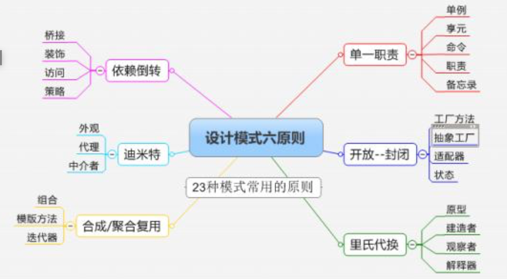

# DesignPatternCpp
23 Design Patterns in Cpp for fun

Learning From [Design Pattern](https://www.bilibili.com/video/BV1kW411P7KS?from=search&seid=5312994722575289482), Refactoring to Pattern but not use pattern intentionally.

